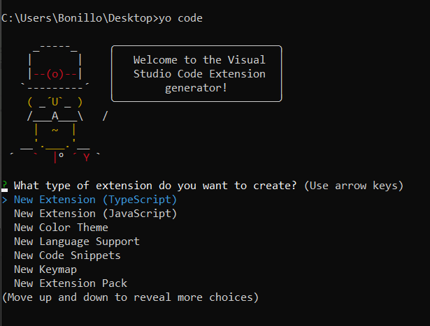

## EXTENSIONES VSCODE
#### 1. Instalar node.js

#### 2. Istalar extensiones

Extensiones para generar una extensión básica de vscode sobre la que podremos trabajar

`npm install -g yo generator-code`

VSCode Estensions: para subir extensiones al marketplace

`npm install -g vsce`

#### 3. Generar una extensión básica

`yo code`

- Nombre de la extensión
- Id de la extensión (Nombre para el marketplace)
- Descripción de la extensión
- Activar en jsconfig.json el type cheking
- Inicializar un repositorio de git
- Gestor de paquetes (npm)