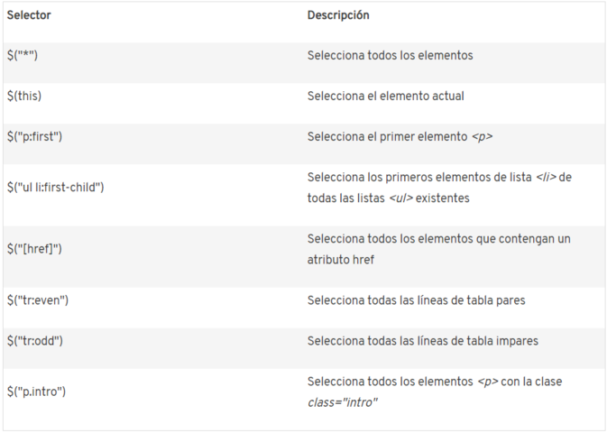
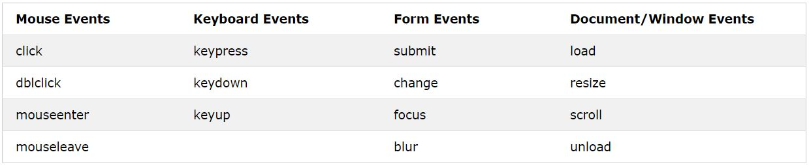

# JQUERY: ESCRIBIR MENOS, HACER MÁS

MIRAR JQUERY CON AJAX

JQuery es  una librería de javascript que sirve para añadir interactividad y efectos visuales a las páginas.

Hay dos formas de integrar JQuery:

* [Descargando la librería](https://jquery.com/download/) para almacenarla en nuestro propio servidor.

```
<script type="text/javascript" src="pfad_a_archivo_ jquery /jquery.js"></script>
```

* Intengrándola de manera externa.

```
<script type="text/javascript" src="http://ajax.googleapis.com/ajax/libs/jquery/3.0.0/jquery.min.js"></script>
```

### SELECTORES

Con JQuery se puede acceder a los elementos de una página mediante selectores (igual que hacemos en css). Esto nos puede ahorrar mucho tiempo ya que nos ahorramos estar escribiendo constantemente ``document.get...(x)``

Los principales selectores de JQuery son:



El símbolo del dólar ($) se antepone al selector y a la acción para distinguir el código como función jQuery. Esto ocurre para evitar confusiones cuando se utilizan diferentes bibliotecas.

    $("p")

Justo después del selector va la acción a realizar (funciones de JQuery):

```
$("p").ready(function(){
    //Código
});
```


La función ready() hace referencia a cuando el HTML haya terminado de cargarse. En el caso anterior le estamos indicando que ejecute el código cuando se hayan cargado todos los párrafos.

```
<script type="text/javascript">
  $(document).ready(function(){
    $("button").click(function(){
      $(".testblock").hide();
    });
  });
</script>
```

Este trozo de código hace que, una vez que todos los elementos de HTML se han cargado, a todos los botones se le añade una función para el evento 'onclick' que hará que todos los elementos que sean de la clase 'testblock' se escondan.

A continuación veremos los tipos de selectores que existen:

#### SELECTOR DE TODO

Todo lo que asignemos a este selector, se le asignará a todos los elementos de la página.

´´´
$("*")
´´´

#### SELECTORES DE ETIQUETA

Son aquellos que hacen referencia a las etiquetas HTML.

```
$("a") || $("h1") || $("p")
```

#### SELECTORES DE ID

Hacen referencia al valor del atributo id de los elementos.

```
<div id="capaPrincipal">...</div>

$("#capaPrincipal")
```

#### SELECTORES DE CLASE

Estos hacen refesencia al valor del atributo **class**.

```
<p class="prueba">...</p>

$(".prueba")
```

#### SELECTORES DE ATRIBUTOS


### EVENTOS DESENCADENANTES

Los usuarios que visiten nuestra página realizarán acciones a las que podemos asignarles o no una reacción. Los más importantes son:



#### EVENTOS DE RATÓN

* __Click__: El código se ejecutará al hacer click sobre el elemento.
* __Dblclick__: El código se ejecutará al hacer doble click sobre el elemento.
* __MouseOver__: El código se ejecutará cuando el ratón esté sobre el elemento o sobre aguno de sus hijos.
* __MouseEnter__: El código se ejecutará cuando el ratón se posicione sobre el elemento. Para entender mejor la diferencia este entre y el anterior veamos un [ejemplo](examples/jquery/ex09.html)
* __MouseLeave__: El código se ejecutará cuando el ratón, estando sobre un elemento, deje de estarlo.
* __Hover__: Es una forma abreviada de asignarle a un elemento los dos eventos anteriores. Esta función recibe dos parámetros de los cuales el primero se ejecutará cuando suceda el evento 'mouseenter' y el segundo se ejecutará con 'mouseleave'. Veamos un [ejemplo](examples/jquery/ex01.html) para entenderlo bien.

* __MouseDown__: El código se ejecutará mientras el botón del ratón no se suelte.
* __MouseUp__: El código se ejecutará cuando el botón que se tenga presionado del ratón se suelte.

Para entender mejor estos dos últimos, aquí tenemos un [ejemplo](examples/jquery/ex02.html).

Si en el ejemplo probamos a hacer 'mousedown' sobre uno de los párrafos, arrastramos el ratón fuera del párrafo y hacemos 'mouseup', vemos que el color se queda en rojo. Si hacemos 'mousedown' sin tener el ratón puesto encima del párrafo, arrastramos hasta el párrafo sin soltar y una vez encima de este hacemos 'mouseup', veremos que el párrafo se vuelve azul.

Podemos distinguir entre los distintos botones del ratón dandole así una acción a cada uno de ellos. Para esto tenemos que saber que los botones del ratón tienen asignados un número cada uno siendo:
* 1 -> Botón izquierdo
* 2 -> Botón central
* 3 -> Botón derecho

Podemos probar esto con un simple [ejemplo](examples/jquery/ex03.html)

#### EVENTOS DE TECLADO

* __KeyPress__: El código se ejecutará cuando se presione una tecla. Este evento es aplicable a 'input' cuando tengan el foco o al objeto document. [Ejemplo](examples/jquery/ex04.html)
* __KeyDown__: El código se ejecutará mientras se mantenga pulsada una tecla, sin soltarla.
* __KeyUp__: Ej código se ejecutará en el momento que una tecla pulsada se suelte.

Los dos últimos van un poco de la mano ya que lo más normal es no usar uno sin el otro (keypress). Vamos a ver su funcionamiento de una forma más clara con un [ejemplo](examples/jquery/ex05.html).

Usando estos eventos podemos hacer que ocurran cosas distintas según la tecla que se pulse. Para ello tendremos que buscar el código ASCII de la tecla. Sería algo [así](examples/jquery/ex06.html).

#### EVENTOS DE FORMULARIOS

* __Submit__: El código se ejecutará al pulsar el botón submit o al pulsar enter. Se ejecutará antes de mandar los datos a donde mande el 'action' del formulario. Lo común de este evento es que se use para comprobar que el formulario no tiene fallos. Lo veremos mejor con un [ejemplo](examples/jquery/ex07.html).

* __Focus__: Este evento se produce cuando un elemento (como un input o un button) recibe el foco.
* __FocusIn__: Este evento se produce cuando un elemento (o cualquiera de sus hijos) recibe el foco.
* __Blur__: Este evento se produce cuando un elemento pierde el foco.
* __FocusOut__: Este evento se produce cuando un elemento (o cualquiera de sus hijos) pierde el foco.
* __Select__: Este evento se produce cuando se selecciona un texto en un campo de texto (input o textarea).
* __Change__: Este evento se produce cuando el valor de un elemento cambia. Solo funciona con **input**, **textarea** y **select**.